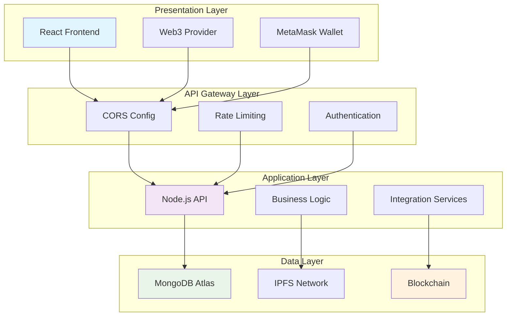
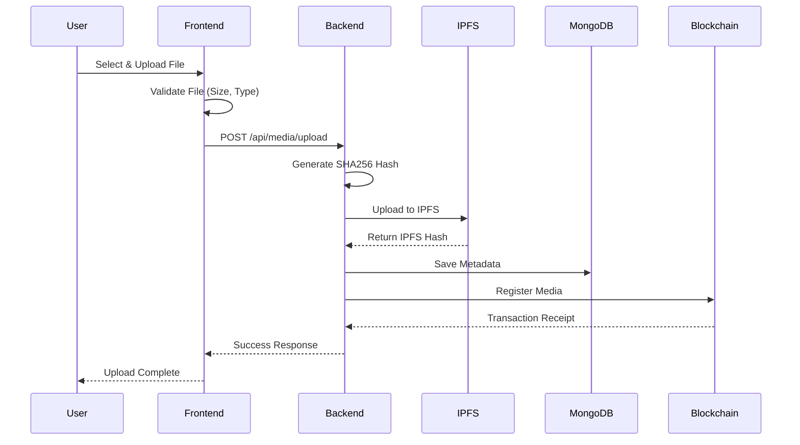
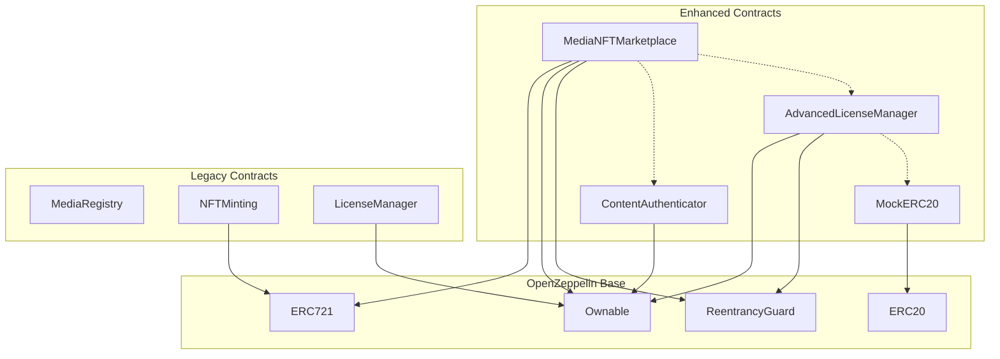
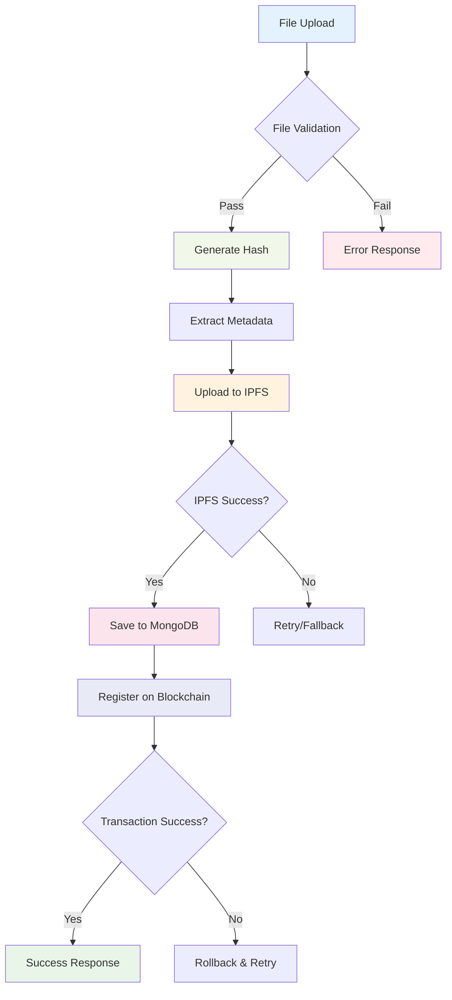
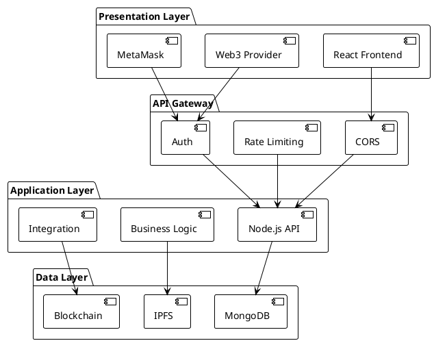
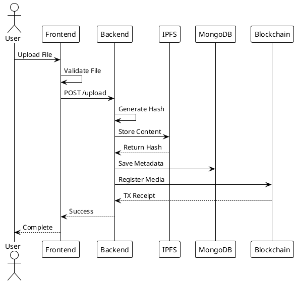

# 🎨 Visual Diagram Creation Guide

## Overview
This guide provides various methods to convert the text-based diagrams into visual formats (PNG, SVG, PDF) using different tools and platforms.

---

## 🛠️ Method 1: Mermaid.js Diagrams (Recommended)

Mermaid is perfect for creating technical diagrams. Here are the key diagrams converted to Mermaid syntax:

### System Architecture Flow


### Content Upload Flow


### Smart Contract Relationships


### Data Processing Pipeline


---

## 🎯 Method 2: PlantUML Diagrams

PlantUML is excellent for UML and architecture diagrams:

### System Architecture (PlantUML)


### Content Upload Sequence (PlantUML)


---

## 📊 Method 3: Draw.io (diagrams.net) XML

For more complex architectural diagrams:

### System Overview (Draw.io format)
```xml
<mxfile host="app.diagrams.net">
  <diagram name="System Architecture">
    <mxGraphModel dx="1422" dy="794" grid="1" gridSize="10" guides="1">
      <root>
        <mxCell id="0"/>
        <mxCell id="1" parent="0"/>
        <mxCell id="2" value="React Frontend" style="rounded=1;whiteSpace=wrap;html=1;fillColor=#dae8fc;" vertex="1" parent="1">
          <mxGeometry x="50" y="50" width="120" height="60" as="geometry"/>
        </mxCell>
        <mxCell id="3" value="Node.js Backend" style="rounded=1;whiteSpace=wrap;html=1;fillColor=#d5e8d4;" vertex="1" parent="1">
          <mxGeometry x="250" y="50" width="120" height="60" as="geometry"/>
        </mxCell>
        <mxCell id="4" value="MongoDB" style="rounded=1;whiteSpace=wrap;html=1;fillColor=#fff2cc;" vertex="1" parent="1">
          <mxGeometry x="50" y="200" width="120" height="60" as="geometry"/>
        </mxCell>
        <mxCell id="5" value="Blockchain" style="rounded=1;whiteSpace=wrap;html=1;fillColor=#f8cecc;" vertex="1" parent="1">
          <mxGeometry x="250" y="200" width="120" height="60" as="geometry"/>
        </mxCell>
        <mxCell id="6" value="" style="endArrow=classic;html=1;exitX=1;exitY=0.5;entryX=0;entryY=0.5;" edge="1" parent="1" source="2" target="3">
          <mxGeometry width="50" height="50" relative="1" as="geometry"/>
        </mxCell>
      </root>
    </mxGraphModel>
  </diagram>
</mxfile>
```

---

## 🚀 How to Create Visual Diagrams

### Option A: Mermaid Live Editor
1. Go to https://mermaid.live/
2. Copy the Mermaid code above
3. Paste and edit as needed
4. Export as PNG/SVG

### Option B: PlantUML Online
1. Go to https://www.plantuml.com/plantuml/
2. Copy the PlantUML code above
3. Generate diagram
4. Download as PNG/SVG

### Option C: Draw.io
1. Go to https://app.diagrams.net/
2. Import the XML or create manually
3. Export as PNG/PDF/SVG

### Option D: Local Tools
- **Mermaid CLI**: `npm install -g @mermaid-js/mermaid-cli`
- **PlantUML JAR**: Download and run locally
- **Draw.io Desktop**: Offline version available

---

## 🎨 Advanced Visualization Options

### 1. Lucidchart (Professional)
- Cloud-based diagramming
- Team collaboration
- Professional templates

### 2. Visio (Microsoft)
- Enterprise diagramming
- Advanced features
- Integration with Office

### 3. OmniGraffle (Mac)
- Professional diagramming
- Beautiful designs
- Export options

### 4. Figma (Design-focused)
- Modern interface design
- Real-time collaboration
- Web-based

---

## 📝 Diagram Templates

I can provide specific templates for:
- System Architecture Diagrams
- Database Schema Diagrams
- API Flow Diagrams
- User Journey Maps
- Technical Infrastructure Maps

---

## 🔧 Automation Scripts

You can also automate diagram generation:

### Mermaid Generation Script
```bash
#!/bin/bash
# Generate all diagrams automatically
mmdc -i system-architecture.mmd -o system-architecture.png
mmdc -i data-flow.mmd -o data-flow.png
mmdc -i smart-contracts.mmd -o smart-contracts.png
```

### Python Script for Batch Generation
```python
import subprocess
import os

diagrams = [
    'system-architecture',
    'data-flow', 
    'smart-contracts',
    'user-journey'
]

for diagram in diagrams:
    subprocess.run([
        'mmdc', 
        '-i', f'{diagram}.mmd',
        '-o', f'{diagram}.png',
        '-w', '1200',
        '-H', '800'
    ])
```

---

Choose the method that best fits your needs. Mermaid is great for technical diagrams, PlantUML for UML, and Draw.io for custom layouts!
